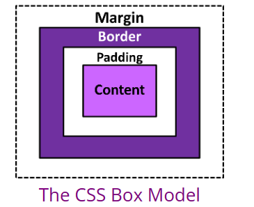

# CSS Box Model Documentation
## Table of Contents

1. [Introduction](#introduction)
2. [Understanding the Box Model](#understanding-the-box-model)
    - [Content Area](#content-area)
    - [Padding](#padding)
    - [Border](#border)
    - [Margin](#margin)
4. [CSS Properties related to Box Model](#additional-resources)
   

  

The CSS Box Model is fundamental to understanding how elements are laid out and styled on a webpage. It consists of four main components: content, padding, border, and margin.

### Content Area
The content area is where the actual content of the element is displayed. This area can be sized using properties like width and height.

### Padding
Padding is the space between the content area and the border of the element. It can be adjusted using the padding property.

### Border
The border surrounds the padding and content areas, defining the visible boundary of the element. Borders can be styled, colored, and sized using various border properties.

### Margin
Margins are the space between the border of the element and surrounding elements. They can be used to create space between elements on the page and can be adjusted using the margin property.

## CSS Properties related to box model
###  Width and Height

- **`width`**: Specifies the width of an element's content area.
- **`height`**: Specifies the height of an element's content area.

### Padding
Sets the padding space around content area.

### Border
Sets the border for an element. It combines the border-width, border-style, and border-color properties.

### Margin
 Sets the margin for all four sides of an element namely;  Sets the margin for all four sides of an element.

 ### Box sizing
  Defines how the width and height of an element are calculated, including paddding
  
  
